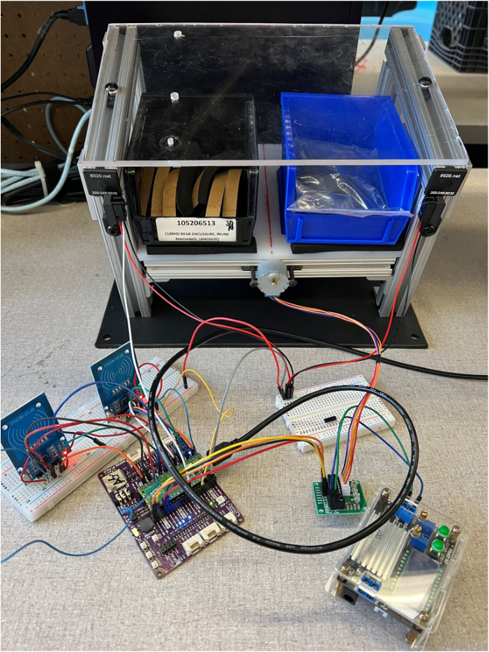

# RPIPico Inventory Management

This was made for an example of a part-picking inventory management system. The system utilizes two RFID scanners, two buttons, a stepper motor, and a beam sensor. A prototype of the system can be seen below.

The black and blue bins have a RFID card taped to their underside. The RFID readers are supposed to be taped underneath the floor of the prototype. When a bin is loaded, the RFID reader will read the card and
store information regarding which side of the device is loaded (left or right) and what the card's ID is. GP20 and GP21 are used for opening the gate corresponding to the side the blue or black bin are on.
The buttons open whichever side holds the bin with the card ID hardcoded into the program. In my example, GP20 corresponds to the blue bin with card ID 335783353 while GP21 corresponds to card ID 461520631.
Once a user presses a button, the motor will spin to open a gate on whichever side the corresponding bin is on. In the above prototype image, the gate is not attached to the motor. Once it opens, the user
has a few seconds to put their hand in to take parts out of the bins. The beam sensor detects if a user has their hand going into the bin. Once the beam sensor no longer senses the user's hand, the motor
will close the gate.

## Usage

The code relies on [mfrc522.py](https://github.com/danjperron/micropython-mfrc522). This should be uploaded to the Raspberry Pi Pico.

The following pins were used for my setup:

### RFID Scanner #1:

| Signal | GPIO Pico |
| ------ | --------- |
| sck    | 2         |
| mosi   | 3         |
| miso   | 4         |
| rst    | 0         |
| cs     | 1         |

### RFID Scanner #2:

| Signal | GPIO Pico |
| ------ | --------- |
| sck    | 10        |
| mosi   | 11        |
| miso   | 12        |
| rst    | 8         |
| cs     | 9         |

### Stepper Motor:

| Inputs | GPIO Pico |
| ------ | --------- |
| IN1    | 18        |
| IN2    | 19        |
| IN3    | 16        |
| IN4    | 17        |

### Beam Sensor:

| Inputs | GPIO Pico |
| ------ | --------- |
| sensor | 27        |

### Buttons:

| Button | GPIO Pico |
| ------ | --------- |
| Blue   | 20        |
| Black  | 21        |
